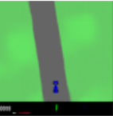

# Image-based-Control-Example


The requirements:

```
pip install -r requirements.txt

```
This is an example showing a controller use image as input to generate corresponding action.

Here I use a generative model (VAE) to generate a random image with size (3,96,96) with random latent vector (1,32) as a input of decoder.

```python
    device = "cuda"
    vae = VAE().to(device)
    best = torch.load("Copy of Copy of real_large_best_model.pth")
    vae.load_state_dict(best)
    vae.eval()
    x = torch.randn(1, 32).to(device)
    img = vae.decode(x)
```




The controller will take the image as input to generate an action

```python

    agent = Agent()
    agent.load_param()
#...
    action = agent.select_action(duplicated_gray_images)


```


```
action (steering,gas,breaking) is: 
[0.1077622  0.17143323 0.09231098]
```
